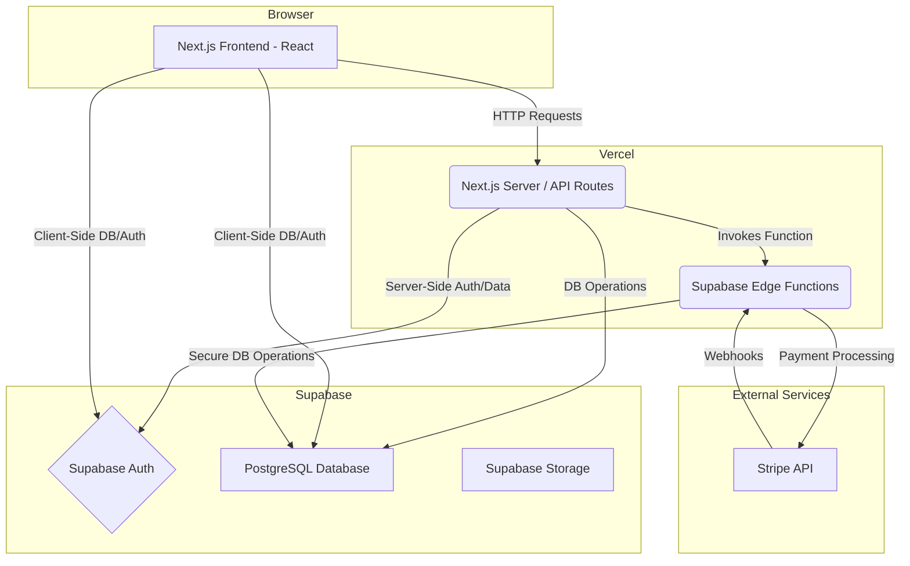

# CycleGrowth - AI-Powered Personal Growth System

CycleGrowth is a full-stack SaaS application designed to help users systematically manage their personal and professional development. It provides tools for creating growth frameworks, tracking progress through distinct cycles, and leveraging an evolving AI assistant for personalized guidance.

**Live Demo:** https://cyclegrowth.jlstudio.xyz/

---

## 🚀 Core Features

* **User Authentication:** Secure sign-up, sign-in, and password management using Supabase Auth.
* **Growth System Builder:** Users can create personalized growth frameworks for different life domains (e.g., Professional Skills, Health & Fitness).
* **4-Phase Growth Cycle:** Each system guides the user through four distinct phases: Planning, Execution, Analysis, and Improvement. The system's current phase is managed as a state machine.
* **Task Management:** Users can create, track, and update tasks associated with their growth systems.
* **Knowledge Hub:** A Zettelkasten-inspired system for capturing and connecting insights and learnings.
* **Subscription & Payments:** Integration with Stripe for managing user subscriptions to unlock advanced AI features.
* **Evolving AI Assistant ("Cyclo"):** An AI partner that provides increasingly sophisticated guidance as the user progresses.

---

## 🛠️ Technical Stack & Architecture

This project is built with a modern, scalable, full-stack architecture.

* **Framework:** Next.js 14 (with App Router)
* **Language:** TypeScript
* **Backend & Database:** Supabase (Auth, Postgres, Storage)
* **Serverless Functions:** Supabase Edge Functions (Deno) for handling specific backend logic like payment processing and task updates.
* **Payment Gateway:** Stripe for subscription management.
* **Styling:** Tailwind CSS
* **UI Components:** shadcn/ui
* **Deployment:** Vercel

### Architecture Highlights

* **Server Components & Actions:** Leverages Next.js Server Components for data fetching and Server Actions for secure form mutations.
* **BaaS Integration:** Deeply integrated with Supabase for a robust and scalable backend, reducing the need for traditional server management.
* **Database Migrations:** Database schema is version-controlled using Supabase's migration tools, ensuring consistency and reliability.
* **State Machine for Growth Cycles:** The `current_phase` of a growth system is a clear implementation of a state machine, controlling the application logic and UI at each stage.

### System Architecture Diagram (Mermaid)

---

## 🔑 Key Challenges & Learnings

* **Designing a Scalable Multi-Tenant Schema:** Architecting the database to support multiple users while ensuring data privacy and performance.
* **Implementing a State Machine for Growth Cycles:** Ensuring the logic for phase transitions is robust and correctly reflects the user's journey.
* **Securely Integrating Stripe Webhooks:** Building a reliable webhook endpoint within a serverless function to handle asynchronous payment events and update user subscription status.

---

## ⚙️ Running Locally

1.  Clone the repository.
2.  Install dependencies: `npm install`
3.  Set up your `.env.local` file with Supabase and Stripe credentials. (See `.env.example`)
4.  Run the development server: `npm run dev`
